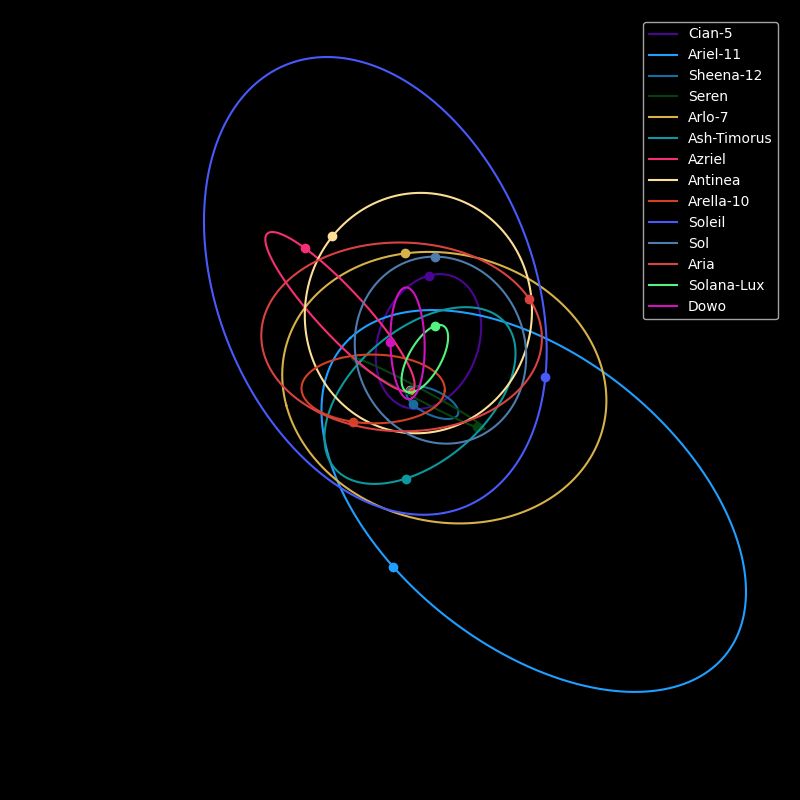
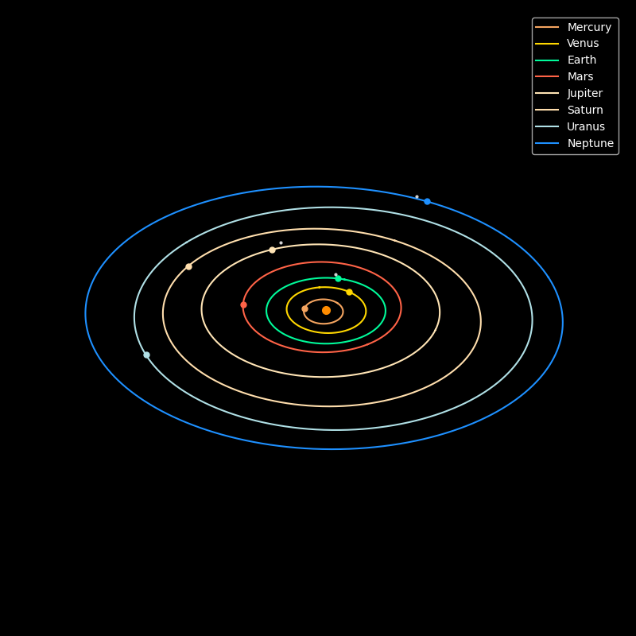

# 🪐 Planetary system simulator

This program can generate and simulate planetary systems. Our solar system has been added in the `solar_system.py` file, this file can be found in the main folder. Make sure all the other files from the main and sounds folder are present and run `solar_system.py` to simulate our solar system. It is also possible to generate and simulate a random planetary system. Run `random_planetary_system.py` to do this.

Also a file called `solar_system_ntc.py` is present. Run this file to simulate the solar system (put dt in `calc_orbit.py` to 5000), but NOT to scale. This way the planets and moons are better visible, but keep in mind that all the distances are incorrect.

In `calc_orbit.py` a time-step dt is defined. This is the amount of seconds between each calculated coordinate. Changing this value can cause problems as it might not generate enough points (when too big), but you can play around with it to alter the speed at which the planets are moving on screen.

Following image shows our solar system:

Here is an example of a random planetary system:

This is our solar system, but the NOT to scale version:

